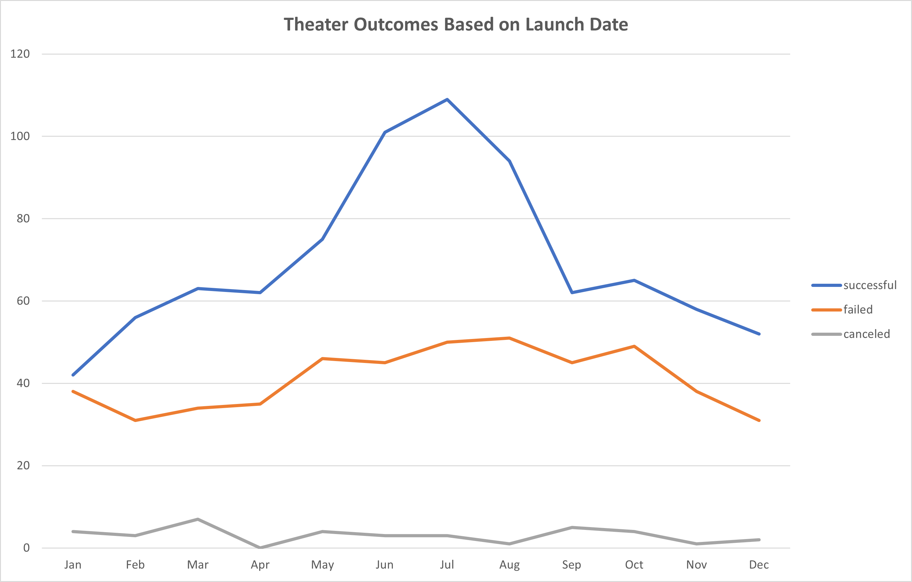

# Kickstarting with Excel

## Overview of Project

### Purpose

This analysis is meant to show the relationship between Kickstarter funding goals and their launch dates for theater campaigns. It will help determine when are the best times to launch a kickstarter, and the funding goal amount that is most likely to be met.

## Analysis and Challenges

### Analysis of Outcomes Based on Launch Date

{:width="438px"}

### Analysis of Outcomes Based on Goals

### Challenges and Difficulties Encountered

## Results

- What are two conclusions you can draw about the Outcomes based on Launch Date?

- What can you conclude about the Outcomes based on Goals?

- What are some limitations of this dataset?

- What are some other possible tables and/or graphs that we could create?
- 
